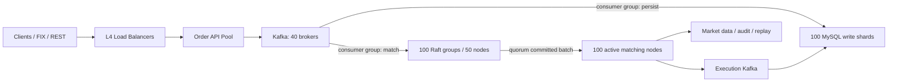

# 500 万 TPS 生产部署方案

## 1. 目标与验收口径

本方案面向持续 5,000,000 条订单命令/秒，不把 500 万 TPS 作为只能维持数秒的峰值。

| 指标 | 生产验收目标 |
|---|---:|
| 持续入口吞吐 | >= 5,000,000 commands/s，持续 60 分钟 |
| 设计容量 | >= 7,150,000 commands/s（按 70% 利用率） |
| Kafka 生产延迟 | p99 <= 20 ms |
| Raft quorum commit | p99 <= 20 ms，batch=1000 |
| Kafka 到撮合完成 | p99 <= 100 ms |
| Kafka 到 MySQL 可见 | p99 <= 500 ms |
| 故障切换 | 单机故障 RTO <= 10 s，RPO=0（已 quorum commit） |
| 回放一致性 | 订单簿、成交序列和 fingerprint 100% 一致 |

所有 TPS 都按业务命令数统计，不按 HTTP 请求数、Kafka batch 数或 Raft entry 数统计。下单、撤单、改单均计一条命令。

## 2. 容量模型

最低配置为 100 个 category、100 个 Raft group：

```text
5,000,000 / 100 = 50,000 commands/s/category
7,150,000 / 100 = 71,500 commands/s/category（设计值）

batch=1000 时：
71,500 / 1000 = 71.5 Raft entries/s/group
```

因此，每个 group 必须稳定完成至少 72 次/秒的 quorum commit、WAL group commit 和 applied watermark。任何 group 低于 72k commands/s，都不能签署 500 万 TPS 验收。

建议从第一天支持将热点 category 拆成 200 个 category/group。200 group 时每组设计负载降为约 35,750 commands/s，故障余量明显更健康。

## 3. 目标拓扑



推荐资源规模：

| 角色 | 数量 | 单机最低配置 | 说明 |
|---|---:|---|---|
| Kafka broker | 40 | 32 cores, 128 GiB, 2 x 3.84 TB NVMe, 25 GbE | RF=3，broker 与 Raft 不混部 |
| Raft node | 50 | 32 cores, 128 GiB, 2 x 3.84 TB NVMe, 2 x 25 GbE | 100 group x 5 replica，共 500 replica，每机平均 10 个 |
| Matching node | 100 active + 20 spare | 32 cores, 128-256 GiB, 1 x NVMe, 25 GbE | 每个 category 一个 active owner，预留 20% 故障容量 |
| MySQL primary | 100 | 32 cores, 256 GiB, 2 x NVMe RAID1, 25 GbE | 每个逻辑库一个写主、100 张表 |
| MySQL replica | >= 100 | 与 primary 同级 | 至少一同步/半同步副本；分析查询走只读副本 |
| Order API | 20-40 | 16 cores, 32 GiB, 25 GbE | 无状态、长连接 producer、按 lag 背压 |
| Control plane | 6-10 | 8 cores, 32 GiB | 路由、迁移、审计、配置和运维 API |
| Observability | 8-12 | 按保留周期配置 | Prometheus/Thanos、日志、trace、告警 |

8 GiB 的开发机规格不适用于该目标。生产 Raft 与 MySQL 必须使用本地企业级 NVMe，不使用网络盘承载 WAL。

### 3.1 按机器规格注入参数

以下是起始基线，不是固定生产值。每台机器通过独立 `.env`、ConfigMap 或机器清单注入，压测后按内存水位和 fsync p99 校准：

| 节点档位 | `TC_ORDER_MAX_PIPELINE_BACKLOG` | `TC_ASSET_WAL_MAX_OPEN_WRITERS` | `TC_ASSET_WAL_BUFFER_BYTES` | `TC_WAL_PREALLOCATE_BYTES` |
|---|---:|---:|---:|---:|
| 本地 8 GiB 全栈 | 50,000 | 1,024 | 8 KiB | 0 |
| 128 GiB 通用 Raft 节点 | 按 Order API 独立配置 | 8,192 | 32 KiB | 64-256 MiB/asset |
| 256 GiB 热点资产独占节点 | 按热点 category 单独限流 | 1,024-4,096 | 64-256 KiB | 1-4 GiB/asset |

`TC_ORDER_MAX_PIPELINE_BACKLOG` 应按以下方式计算，而不是直接照抄表格：

```text
max_backlog = 可用于流水线的内存字节
              / 压测得到的每命令驻留字节
              / Raft 副本与重试放大系数
```

取计算值与“2 秒设计流量”的较小值，并保留至少 30% 内存余量。WAL writer 上限不得低于单条 Raft entry 的最大命令数，否则当前批次可能在 durability barrier 前淘汰 writer。

## 4. Category 与路由

所有链路使用同一个版本化路由记录：

```text
Route {
  category_id,
  route_version,
  kafka_topic,
  kafka_partition,
  raft_group,
  matching_owner,
  mysql_database,
  mysql_table_range,
  state: ACTIVE | FREEZING | CATCHING_UP | DRAINING
}
```

强制不变量：

1. 同一 category 的订单与撤单只能进入一个 Kafka partition。
2. 一个 category 在任一 route_version 下只能对应一个 Raft group。
3. 只有 quorum-committed 命令可以进入撮合队列。
4. 每个资产保持独立 `asset-N.wal`，可在其他机器验证和回放。
5. 路由变更必须先冻结写入、增量追平、校验 fingerprint，再原子切换版本。

不要在生产中直接修改 `TC_ORDER_CATEGORY_SIZE`。category 归属应存放在控制面元数据中；算术路由只作为冷启动默认值。

## 5. Kafka 设计

### 5.1 订单命令

- 20 个订单 topic，每个 10-20 个 partition，初始共 200-400 partitions。
- category 显式映射到固定 topic/partition；key 为 4 字节 `category_id`。
- `replication.factor=3`，`min.insync.replicas=2`，producer `acks=all`。
- producer 启用 idempotence、长连接、压缩和 1-2 ms linger。
- MySQL 与 Raft 使用不同 consumer group，同时消费，不串行等待。
- 每个 partition 只有一个活跃消费流水线，独立处理、重试和提交 offset。

建议生产参数：

```text
batch.num.messages=10000
linger.ms=1..2
compression.type=lz4
enable.idempotence=true
max.in.flight.requests.per.connection=5
delivery.timeout.ms=10000
```

### 5.2 成交事件

- 独立 execution topics，至少 200 partitions。
- key 仍为 category，保证同 category 成交事件有序。
- 事件 ID 使用 `(raft_group, raft_index, report_ordinal)`，不能只用 `order_id`。
- 撮合报告先进入持久化 execution WAL/outbox，Kafka ACK 后推进发布水位。
- MySQL 以 event ID 唯一键幂等投影；Kafka offset 只用于消费进度，不作为业务唯一键。

### 5.3 背压

Order API 必须同时观察 persist group 与 match group：

```text
soft limit: lag >= 2 秒设计流量 -> 降低接入速率
hard limit: lag >= 5 秒设计流量 -> HTTP 429 / FIX throttle
emergency: lag >= 15 秒或 quorum 丢失 -> 停止该 category 写入
```

背压按 category 生效，不能因为一个热点 category 阻断全市场。

## 6. Raft 与 WAL

- 100 个独立 Raft group，每组 5 replica，副本分布在 5 个不同故障域。
- 每条 Raft entry 携带 100-1000 条同 category 命令，目标 batch=1000。
- 每批只执行一次 Raft Ready 持久化和 quorum commit。
- 已提交批次按资产拆入独立 WAL；所有触达 WAL flush 后执行一次文件系统 group commit。
- 数据 WAL 持久化完成后，才允许持久化 applied watermark。
- Leader fencing 绑定 term、leader ID 和 route_version。
- readiness 必须同时满足 leader 已知、quorum 可用、replay 完成、WAL 可写。

50 台 Raft 机器承载 100 group 时，每台平均运行 10 个 replica。需要将线程固定到 CPU，并让空载线程休眠；禁止空载 busy-spin 消耗所有核心。

## 7. 撮合部署

- 100 台 active matching node 对应 100 个 category owner。
- 至少再准备 20 台 spare，或确保每台 active 长期低于 70% CPU/内存。
- 每一种资产保持独立撮合队列和独立 WAL。
- 热点资产可以从 category 中拆出，迁移到独立 category、Raft group 和 matching node。
- 撮合状态以内存为主，启动时通过快照 + WAL tail 恢复。
- 每次发布必须执行 live/replay fingerprint 对比测试。

如果继续使用当前 `raft-node` 内嵌撮合的实现，则“50 台 Raft + 100 台撮合”不是两个独立资源池。上线前必须二选一：

1. 保持 Raft 与撮合共进程，将 100 台撮合机同时作为 Raft replica 宿主；或
2. 拆分 committed-command transport，让独立撮合节点只消费带 fencing token 的已提交命令。

推荐第一阶段共进程，减少一次网络跳转；完成 500 万验收后再评估拆分。

## 8. MySQL：100 库、10000 表

- 100 个物理写分片，每库 100 张订单表，总计 10000 表。
- 以 category 路由，不以 user ID 路由。
- category 内请求天然进入同一写分片；批量写入 500-1000 行/事务。
- 主键使用订单 ID，另建 `(category_id, category_seq)` 唯一索引。
- 成交投影使用确定性 event ID 唯一索引。
- 禁止在高峰期执行 DDL；新表直接使用目标 `CREATE TABLE` 模板创建，不依赖在线 migration SQL。
- 历史订单按时间分区/归档，活跃索引控制在 buffer pool 内。

每个写主的设计值：

```text
7,150,000 / 100 = 71,500 rows/s
batch=1000 -> 约 72 个事务/s/实例
```

该目标必须使用批量 prepared statement、最小必要索引和本地 NVMe。逐订单事务不能通过验收。

## 9. 网络与故障域

- Kafka、Raft、MySQL 使用独立 VLAN 或独立物理网络队列。
- Raft 节点双 25 GbE；复制流量与客户端/监控流量分离。
- 服务间使用隔离内网和 ACL，数据面保持明文长连接，避免 TLS 握手与加解密开销。
- Raft 五副本跨 5 个 rack，至少跨 3 个可用区。
- NTP/PTP 时钟偏差告警阈值 50 ms；撮合顺序不依赖墙钟。
- 禁止同一 group 的两个 replica 落在同一物理宿主、机架或电源域。

## 10. 监控与告警

必须采集并按 category/group 分解：

- Kafka produce TPS、bytes、ISR、under-replicated partitions、consumer lag。
- `mysql_commit_ms`、事务批大小、锁等待、redo fsync、buffer pool hit rate。
- `raft_commit_ms`、term、leader、quorum、proposal queue、raft lag。
- `wal_fsync_ms`、WAL bytes、磁盘延迟、磁盘剩余空间、applied watermark。
- `match_ms`、queue depth、订单簿深度、拒绝数、撮合报告积压。
- execution outbox depth、最老未发布事件年龄、重复消费数。

关键告警：

| 条件 | 告警等级 |
|---|---|
| 任一 category Kafka lag > 2 s | Warning |
| lag > 5 s 或 Raft p99 > 20 ms | Critical |
| quorum 不足、WAL 不可写、回放失败 | Page + 自动冻结 category |
| MySQL p99 > 200 ms 持续 1 min | Critical |
| matching memory > 70% 或 queue > 50% | Warning |
| execution outbox 最老事件 > 5 s | Critical |

## 11. 上线步骤

1. 部署监控、日志、网络 ACL、配置中心和路由控制面。
2. 部署 40 broker Kafka，完成 RF=3、故障和吞吐验收。
3. 创建订单与成交 topics，预分配 partitions，不在高峰动态扩 partition。
4. 部署 100 MySQL primary 及副本，创建 100 库/10000 表目标结构。
5. 部署 50 Raft 节点和 100 group，验证每组五副本分散。
6. 部署 matching pool，执行快照/WAL 回放和 fingerprint 校验。
7. 部署 Order API，先关闭外部流量，验证双 consumer group lag=0。
8. 按 1%、5%、20%、50%、100% category 灰度放量。
9. 每个阶段执行 leader kill、broker kill、MySQL failover 和 matching migration。
10. 满负载运行 60 分钟，再进行一台 Raft leader 故障测试。

## 12. 容量验收阶梯

| 阶段 | 目标 | 持续时间 | 通过条件 |
|---|---:|---:|---|
| 热身 | 500k TPS | 15 min | lag 最终归零，无错误 |
| 阶段 1 | 1M TPS | 30 min | p99 达标，资源 < 50% |
| 阶段 2 | 3M TPS | 30 min | 无持续 lag，资源 < 65% |
| 阶段 3 | 5M TPS | 60 min | 所有 SLO 达标，资源 < 70% |
| 容量 | 7.15M TPS | 15 min | 不丢单、不 OOM、恢复后完全追平 |
| 故障 | 5M TPS + leader kill | 15 min | RPO=0，RTO <= 10 s |

测试必须分别报告 Kafka 接受 TPS、Kafka 到 MySQL TPS、Kafka 到 Raft/撮合 TPS和全部追平时间。只报告入口接受数不算通过。

## 13. 当前代码上线前必须完成

当前仓库距离该拓扑还有以下硬性工作：

1. 将 `DB_COUNT=10` 改为版本化、可配置的 100 物理数据库路由。
2. 将本地 4 group Compose 扩展为生产 100 group 的自动生成部署清单。
3. 在已接入 WAL group commit 的基础上，完成断电故障注入和真实 NVMe 基准。
4. 完成按 category 的入口背压、内存水位和最大订单簿容量保护。
5. 完成持久化 execution outbox 与确定性 event ID。
6. 完成 100 group leader 故障、回放、迁移和 fingerprint E2E。
7. 在已修复空载 busy-spin 的基础上，完成生产 CPU affinity 和低负载延迟验收。
8. 将管理面 RBAC、nonce、审计、网络 ACL 和告警接入生产基础设施。

上述项目未全部通过前，不能对外承诺 500 万持续 TPS。
